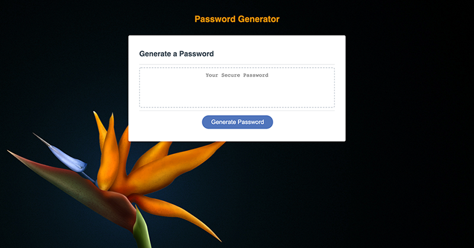
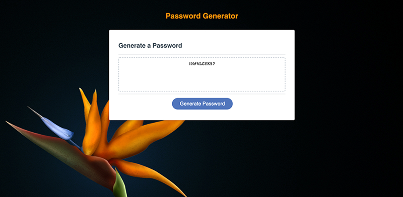

<h1 align="center">Random Password Generator 🔏</h1>

### 🏠 https://crenauro.github.io/Random-Password-Generator/

 

# Install

Open the above link in your browser.
 
 

# Usage

This random password generator creates a strong password to provides greater security.

When you click "Generate Password", a dialog box appears. Answer a series of prompts for password criteria.

When you answer each prompt, my input is validated.

When all prompts are answered, a password is generated that meets the selected criteria.

The password will appear in the central rectangle. Before and after are below.

 
 

# Credits

A huge thanks to my project group and tutor.
Image background is from my archives, it's a old desktop picture.
